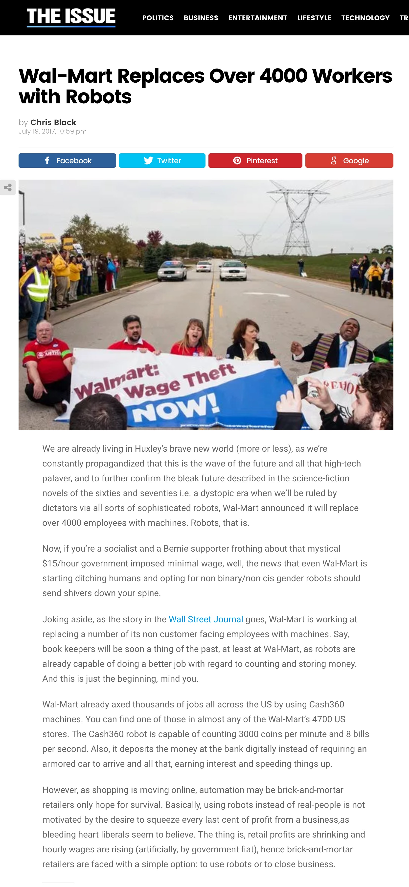
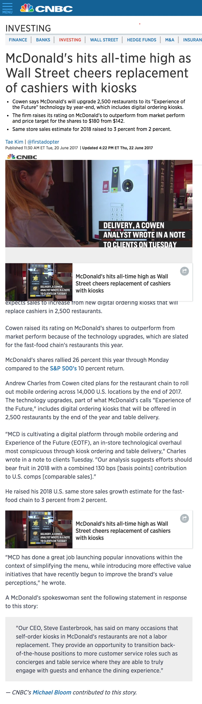
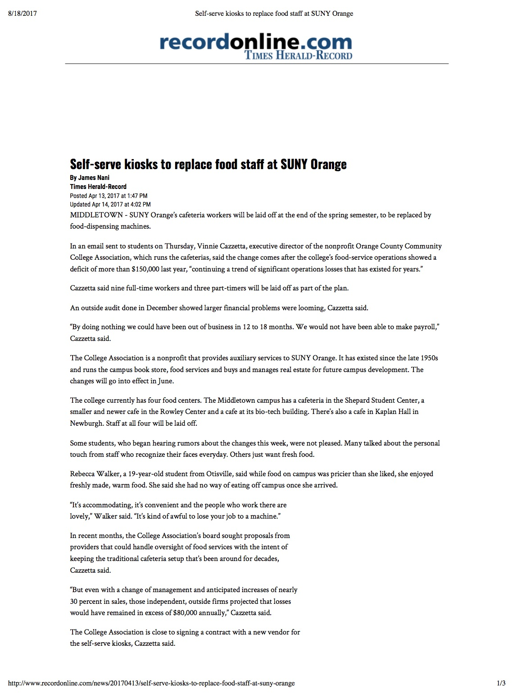
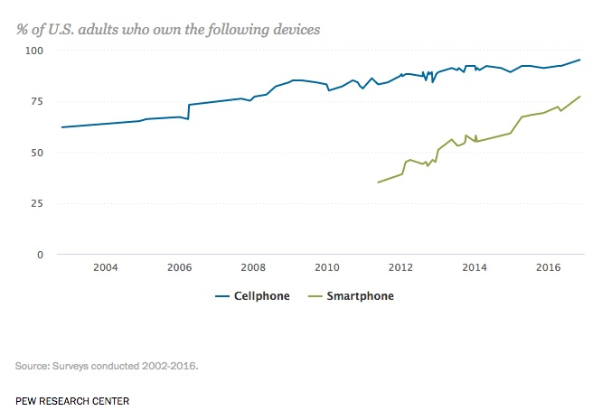

footer: Patrick Rauland - @BFTrick

## Are Robots Coming to Take Your Job?

---

* Walmart replaces 4,000 workers with robots[^1]
* McDonalds replaces cashiers with kiosks in 2,500 restaurants[^2]
* This cafeteria replaced all of their staff with self serve vending Machines[^3]

[^1]: https://www.theissue.com/politics/wal-mart-replaces-over-4000-workers-with-robots

[^2]: https://www.cnbc.com/2017/06/20/mcdonalds-hits-all-time-high-as-wall-street-cheers-replacement-of-cashiers-with-kiosks.html

[^3]: http://www.recordonline.com/news/20170413/self-serve-kiosks-to-replace-food-staff-at-suny-orange

^ Just last month Walmart replaced 4,000 workers with robots.

^ In June McDonalds replaced cashiers with kiosks in 2,500 restaurants. They look just like the airport kiosks.

---

### According to our estimates, about 47 percent of total US employment is at risk.[^4]

[^4]: http://www.oxfordmartin.ox.ac.uk/downloads/academic/The_Future_of_Employment.pdf

^ And even academic literature paints a bleak future But a lot of them reference this study:

^ this is one of the most cited studies which basically says you're fucked. Well 47% of us.

---

^ When you look at these headlines and you look at some of these academic studies the only logical conclusion is:

^ The robots are going to take our jobs and we're all going to die.

^ But I think when it comes to the academic studies there's an assumption.

---

### Assumption:

## If a job _can_ be automated it _will_

^ But I don't think this is true. Maybe over the long term over decades or centuries.

^ Before we start losing our minds that a bazillion jobs have been lost and we're all going to starve in the gutter let's take a look at what's happened so far.

---

^ There are a couple numbers we can look at. The fist is productivity which is tracked by the US Labor Department.

^ And productivity is basically the total amount of good and services divided by the total amount of hours worked

^ So as robots do more work we should see an increase in productivity

^ But actually the opposite has happened.

^ In the 1940s-1970s we were on average 3% more productive every year.

^ But since 2007 it's grown at a rate of 1.2 percent.

^ And the last two years it's been 0.6 percent.

^ So productivity is insanely low. We should be seeing really high productivity because robots are doing jobs for us.

---

^ Also you'd think if automation were happening on a grand scale we'd see a spike in unemployment. But we're below 5% which is healthy.

^ And we're basically back to where we were since 2007 before the recession.

^ Or maybe you'd say that unemployment might not be low if people quickly find another job. But if you look at job churn it's the lowest it's been in decades

^ and if you look at other metrics like job tenure they match up. Job tenure is going up meaning people are working longer at the same company than they were 5-10 years ago.

^ There are other metrics I could show you like Job Churn and that's going down. It doesn't seem like this automation thing has had that big of an affect on our lives quite yet.

---

## Why Automation Isn't Taking Off

^ So even though we've been automating jobs with computers for the last 5 decades it hasn't had much of an affect on jobs.

^ I'd like to take some time to explain why it isn't working. Because again it seems so obvious that it is going to explode our economy.

---

## 1) No Investment

^ One reason we aren't moving faster towards robotics is that we aren't spending any money on it.

^ that small bar is what we invested in robotics here in the US. 11.3 billion dollars.

---

## 1) No Investment

^ The larger bar is 15 billion dollars which is what we spend on sex toys. And don't get me wrong there are some really fun toys out there.

^ But we're spending 15 billion on devices that - well if I can get anywhere close to 5 minutes of use I'm happy.

^ But we're barely investing anything in automation. And at this current pace it will take us decades to perfect all of those things that automation says is right around the corner.

---

## 2) New & Better Jobs

^ There is another reason that we might not be seeing an impact on employment. As jobs are eliminated new jobs are created.

^ Well let me tell you about what my job would have been in the 70s: accounting clerks and bookkeepers.

^ They were human excel spreadsheets. Businesses used to employ a team of accounting clerks to manage their spreadsheets. And this was before computers. So they were the size of board room tables. And you had to calculate every field by hand.

^ Businesses used to want to know if we decreased costs for this product by 5% what happens to our bottom line? And the accounting clerks would go into their nerd caves for days to redo a whole spreadsheet and then they'd produce the results.

---

# VisiCalc

^ Then in 1979 VisiCalc was released for the Apple II computer. And it was the first computer spreadsheet and it quickly spread across the business world. Selling 700,000 copies in six years.

^ So from 1980 a year after VisiCalc was released until 1990 do you know what happened to those accounting clerk jobs?

---

### Lost 400,000 accounting _clerk_ jobs

### Gained 600,000 accounting jobs

^ This is the opposite of what supply and demand tells us. As we make supply more abundant the price of the service should go down and we should see less accountants.

^ But the reason we see the opposite here is because when we made it easy to update spreadsheets we started asking a lot more questions. Before computerized spreadsheets we might have only been able to ask 25 questions a year to our accounting clerks team

---

### Lost 400,000 accounting _clerk_ jobs

### Gained 600,000 accounting jobs

^ After the computerized spreadsheet we could ask hundreds or thousands of questions and create more advanced & accurate spreadsheets.

^ Many of those accounting clerks kept their jobs and just had to learn a new technology.

^ So even when you think automation might kill an entire industry it could infact grow it.

---

## 3) Talent Barrier

^ I've already mentioned money. But another factor is that to solve even simple problems it takes an insanely talented team.

^ And the best example of this is how just a few months ago we taught a computer to beat the world champion at a game called Go.

---

# Go

^ Everyone here knows a computer beat the world champion of chess. And that happened in 1996.

^ Go is much more complex than chess in terms of the moves & positions. So it took a lot longer to solve this problem. In fact it took an entire company called DeepMind which was acquired by Google to solve  this game.

^ The researchers had to create 3 separate neural networks that all used different strategies to win at Go. And then they had a main program that would pick the right strategy at the right time.

^ And this is the perfect example of something that can be automated if there's enough time and money. It took an incredibly smart team years to beat humans at Go. And this was a board game created over 2,000 years old.

^ I actually do believe that 47% of our jobs could be automated if we have unlimited time, money, & talent.

^ Lucky for us humans we have limited resources.

---

## 4) Humans are Stubborn

^ Even when there's an amazing product like smartphones, or just simple cellphones, or elevators with buttons. It takes humans decades to actually get used to them.

^ 23% of Americans still don't use a smartphone and those cost $20 new for the cheaper models.

---

## A.utomated
## T.eller
## M.achine

^ The First ATM came out in 1967. That's 50 years ago and they haven't replaced tellers in banks.

^ It's name is literally Automated Teller Machine.

^ It takes a long time for us to change.

---

## Job Losses

* Industrial Automation (since 1990): -670,000[^9]
* Trade with China (1999-2011): -2.4 million[^9]

[^9]: https://economics.mit.edu/files/12763

^ Why are we so worried?

^ Two economists from MIT published a paper earlier this year about what happened to manufacturing jobs in the US.

^ So why do we believe this? We have the numbers that says our economy is not going to be overrun with robots.

^ I think we believe all of the hype about automation because it seems true.

^ Here's the thing the US has lost a lot of jobs in the last 3 decades.

---

# What's Coming

^ My main message here isn't that automation is irrelevant.

^ But we're not spending enough money on it, there will be new jobs, there isn't enough talent to work on all the problems at once, and we're stubborn. So it's going to be a while before it becomes a huge problem.

### Patrick Rauland - @BFTrick
