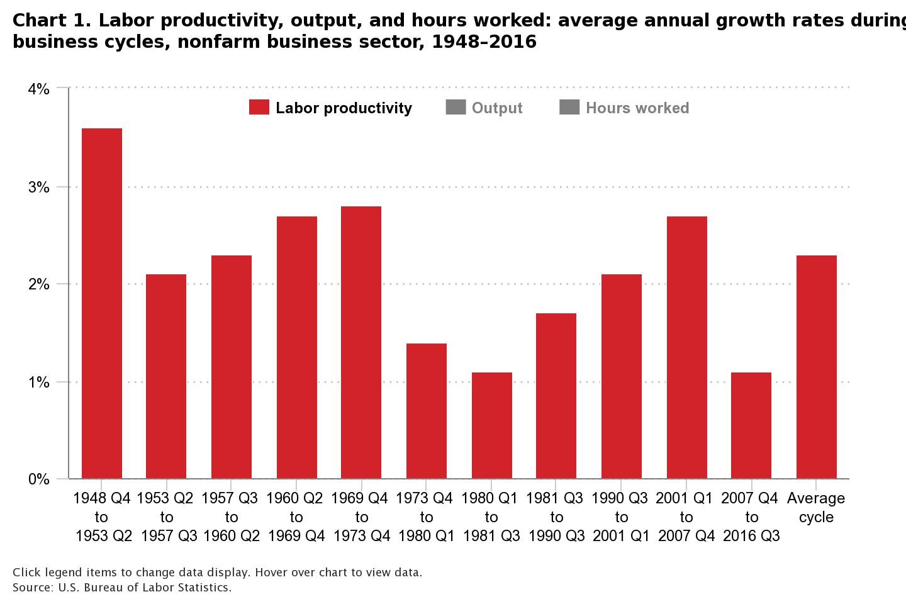
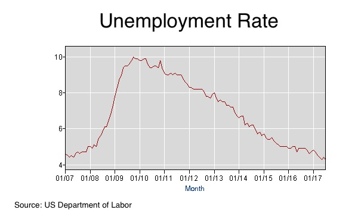
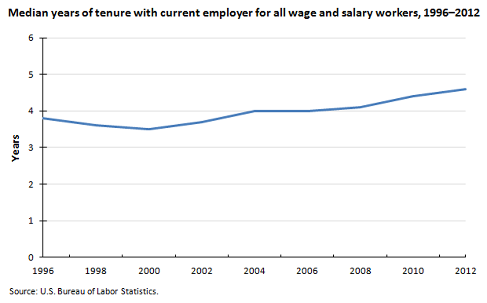
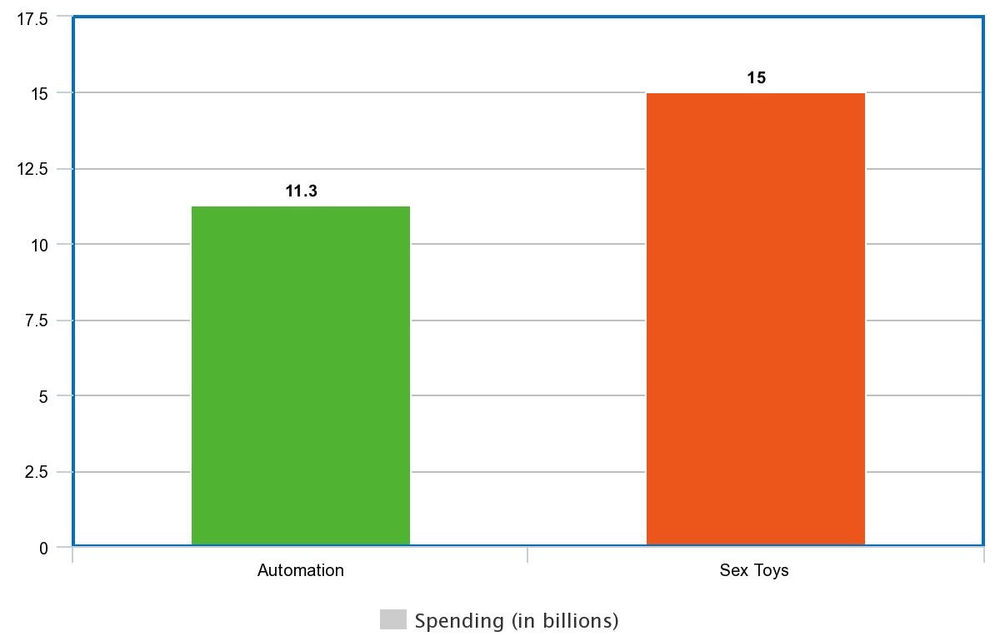

footer: Patrick Rauland - @BFTrick

## Are Robots Coming to Take Your Job?

^ I work in retail. And every day we hear about how there's some new robot that's coming for our job.

---

* Walmart replaces 4,000 workers with robots[^1]
* McDonalds replaces cashiers with kiosks in 2,500 restaurants[^2]
* This cafeteria replaced all of their staff with self serve vending machines[^3]

[^1]: https://www.theissue.com/politics/wal-mart-replaces-over-4000-workers-with-robots

[^2]: https://www.cnbc.com/2017/06/20/mcdonalds-hits-all-time-high-as-wall-street-cheers-replacement-of-cashiers-with-kiosks.html

[^3]: http://www.recordonline.com/news/20170413/self-serve-kiosks-to-replace-food-staff-at-suny-orange

^ Walmart replaced 4,000 workers with robots.

^ McDonalds replaced cashiers with kiosks.

^ And this cafeteria replaced all of their staff with vending machines.

---

### According to our estimates, about 47 percent of total US employment is at risk.[^4]

[^4]: http://www.oxfordmartin.ox.ac.uk/downloads/academic/The_Future_of_Employment.pdf

^ And even academic literature paints a bleak future. This study by Oxford says that 47% of all jobs in the US are at risk.

^ That's scary right?

---

^ When you look at these headlines and you look at some of these academic studies the only logical conclusion is:

^ The robots are going to take our jobs and we're all going to die.

^ But I think when it comes to the academic studies there's an assumption.

---

### Assumption:

## If a job _can_ be automated it _will_

^ But I don't think this is true. Maybe over the long term over decades or centuries.

^ Before we start losing our minds that a bazillion jobs have been lost and we're all going to starve in the gutter let's take a look at what's happened so far.

---

^ There are a couple numbers we can look at. The fist is productivity which is tracked by the US Labor Department.

^ And productivity is basically the total amount of good and services divided by the total amount of hours worked

^ So as robots do more work we should see an increase in productivity

^ But actually the opposite has happened. We're heading towards a productivity slump. This is opposite of what we should see.

---

^ Also you'd think if automation were happening on a grand scale we'd see a spike in unemployment. But we're below 5% which is healthy.

^ and if you look at other metrics like job tenure they match up. Job tenure is going up meaning people are working longer at the same company than they were 5-10 years ago.

^ It doesn't seem like this automation thing has had that big of an affect on our lives quite yet.

---

## Why Automation Isn't Taking Off

^ We've been automating jobs with computers for the last 5 decades it hasn't had much of an affect on jobs.

^ I'd like to tell you why.

---

## 1) No Investment

^ One reason we aren't moving faster towards robotics is that we aren't spending any money on it.

^ that small bar is what we invested in robotics here in the US. 11.3 billion dollars.

---

## 1) No Investment

^ The larger bar is 15 billion dollars which is what we spend on sex toys. And don't get me wrong there are some really fun toys out there.

^ But we're spending 15 billion on devices that - if I can get to 5 minutes of use I'm happy.

^ But we're barely investing anything in automation. And at this current pace it will take us decades to perfect all of those things that automation says is right around the corner.

---

## 2) New & Better Jobs

^ There is another reason that we might not be seeing an impact on employment. As jobs are eliminated new jobs are created.

^ Well let me tell you about what my job would have been in the 70s: accounting clerks and bookkeepers.

---

## 2) New & Better Jobs

^ They were human excel spreadsheets. Businesses used to employ a team of accounting clerks to manage their spreadsheets. And this was before computers. So they were the size of board room tables. And you had to calculate every field by hand.

---

# VisiCalc

^ Then in 1979 VisiCalc was released and we finally had computerized spreadsheets. Something that used to take days now takes seconds.

^ You'd think this would crush account clerking jobs. But actually the opposite happened.

---

### Lost 400,000 accounting _clerk_ jobs

### Gained 600,000 accounting jobs

^ As we make supply more abundant the price of the service should go down and we should see less accountants.

^ What happened was that before computerized spreadsheets we might have only been able to ask 25 questions a year to our accounting team.

---

### Lost 400,000 accounting _clerk_ jobs

### Gained 600,000 accounting jobs

^ After the computerized spreadsheet we could ask hundreds or thousands of questions and create more advanced & accurate spreadsheets.

^ Many of those accounting clerks kept their jobs and just had to learn a new technology.

^ So even when you think automation might kill an entire industry it could infact grow it.

---

## 3) Talent Barrier

^ I've already mentioned money. But another factor is that to solve even simple problems it takes an insanely talented team.

^ And the best example of this is how just a few months ago we taught a computer to beat the world champion at a game called Go.

---

# Go

^ Everyone here knows a computer beat the world champion of chess. And that happened in 1996.

^ Go is much more complex than chess in terms of the moves & positions. So it took a lot longer to solve this problem. In fact it took an entire company called DeepMind which was acquired by Google to solve  this game.

---

# Go

^ The researchers had to create 3 separate neural networks that all used different strategies. And then they had a main program that would pick the right strategy at the right time.

^ It took the DeepMind team years to accomplish this and they're the best of the best.

^ There's an infinite amount of problems in the world and only so many automation engineers.

---

## Job Losses

* Industrial Automation (since 1990): -670,000[^9]
* Trade with China (1999-2011): -2.4 million[^9]

[^9]: https://economics.mit.edu/files/12763

^ Why are we so worried?

^ Two economists from MIT published a paper earlier this year about what happened to manufacturing jobs in the US.

^ We have lost a lot of jobs but most of them weren't due to automation. They were trade policies.

---

# What's Coming

^ My main message here isn't that automation is irrelevant. It is a factor.

^ But we're not spending enough money on it, there will be new jobs, and there isn't enough talent to work on all the problems at once. So it's going to be a while before it becomes a huge problem.

### Patrick Rauland - @BFTrick
